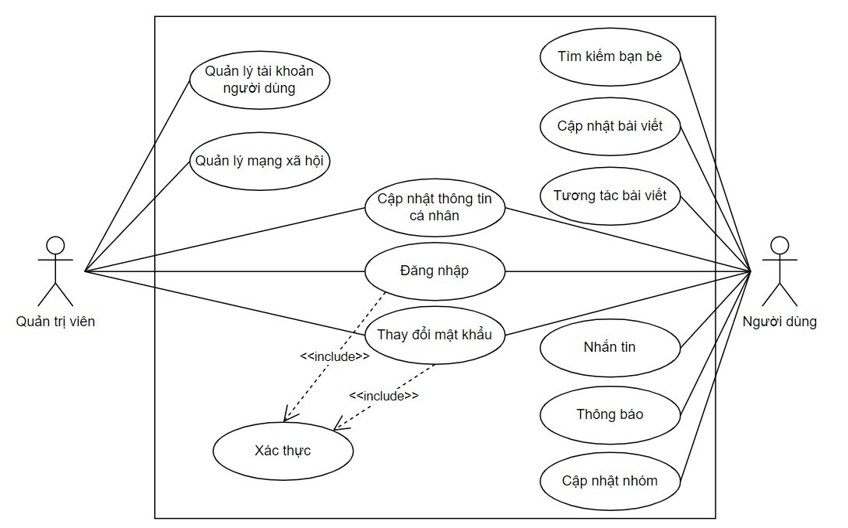
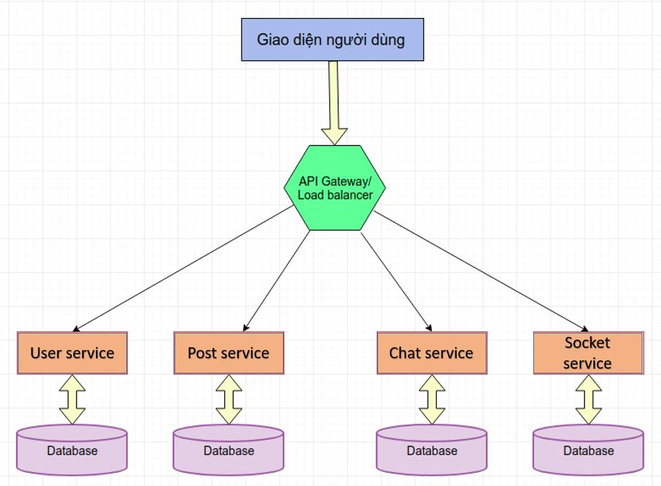

# Backend_SocialMediaApp

- [Deployment](#deployment)
- [Documents](#documents)
  - [Requirements](#requirements)
  - [UseCases](#usecases)
  - [Services](#services)
  
 ## Deployment
 - Không sử dụng docker: 
 
 +) Clone code về máy 
 ```
 $ git clone https://github.com/thaison2000/Backend_SocialMediaApp
 ```
 +) Chạy API GATEWAY
 ```
 $ cd .\backend\api_gateway\
 $ npm install
 $ npm start
 ```
 
 +) Chạy User Service
 ```
 $ cd .\backend\user_service\
 $ npm install
 $ npm start
 ```
 
 +) Chạy Post Service
 ```
 $ cd .\backend\post_service\
 $ npm install
 $ npm start
 ```
 
 +) Chạy Chat Service
 ```
 $ cd .\backend\chat_service\
 $ npm install
 $ npm start
 ```
 
 +) Chạy Socket Service
 ```
 $ cd .\backend\socket_service\
 $ npm install
 $ npm start
 ```
 
 - Sử dụng Docker:
 
 +) Kéo image về tạo thành các container cho các service
 ```
 $ docker-compose build
 ```
 
 +) Chạy ứng dụng trong Docker
 ```
 $ docker-compose up
 ```
 
 ## Documents
 
 ### Requirements
 - NodeJS
 - Socket.io
 - MongoDB
 - Docker
 
 ### UseCases
 - Use Case Diagram:
 
 - Use Cases for User:
    + Dang nhap/Dang ky/Dang xuat
    + Cap nhat thong tin ca nhan
    + Tao/sua/xoa bai viet
    + Tim kiem
    + Ket ban
    + Nhan tin
    + Tuong tac voi bai viet(yeu thich, binh luan, chia se)
    + Nhan thong bao
 - Use Cases for Admin: (Dang phat trien)
    + Dang nhap/Dang ky/Dang xuat
    + Cap nhat thong tin ca nhan
    + Quan ly tai khoan nguoi dung
    + Quan ly mang xa hoi
    
 ### Services
 - Chia lam 3 services chinh:
    + user service
    + post service
    + chat service
    + socket service
 - Kien truc thiet ke:
 
 
